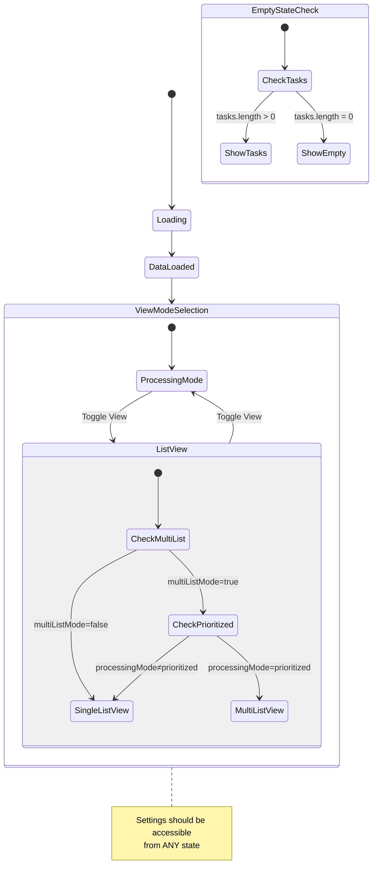

# Todoist Inbox Processor - Architecture Flow

## Data Flow and State Management

```mermaid
graph TB
    %% Initial Data Loading
    Start([App Start]) --> LoadInitial[Load Initial Data]
    LoadInitial --> |API Calls| LoadData{Load from API}
    LoadData --> Tasks[allTasksGlobal: TodoistTask[]]
    LoadData --> Projects[projects: TodoistProject[]]
    LoadData --> Labels[labels: TodoistLabel[]]
    
    %% State Management
    Tasks --> StateManager[State Management]
    Projects --> StateManager
    Labels --> StateManager
    
    StateManager --> ViewMode{View Mode}
    ViewMode -->|processing| ProcessingMode[Processing Mode]
    ViewMode -->|list| ListMode[List Mode]
    
    %% Processing Mode Flow
    ProcessingMode --> ProcessingType{Processing Type}
    ProcessingType -->|project| ProjectFilter
    ProcessingType -->|priority| PriorityFilter
    ProcessingType -->|label| LabelFilter
    ProcessingType -->|prioritized| PrioritizedQueue
    
    %% List Mode Flow
    ListMode --> ListModeCheck{Multi-List Mode?}
    ListModeCheck -->|No| SingleList[Single List View]
    ListModeCheck -->|Yes| MultiListCheck{Processing Mode = prioritized?}
    MultiListCheck -->|No| SingleList
    MultiListCheck -->|Yes| MultiList[Multi-List Container]
    
    %% Task Filtering Pipeline
    Tasks --> GlobalFilters[Global Filters]
    GlobalFilters --> |1. Exclude archived tasks| ExcludeArchived[Remove tasks starting with '*']
    ExcludeArchived --> |2. Exclude labels| ExcludeLabels[Remove tasks with excluded labels]
    ExcludeLabels --> |3. Assignee filter| AssigneeFilter{Assignee Filter}
    
    AssigneeFilter -->|all| AllTasks[All Tasks]
    AssigneeFilter -->|unassigned| Unassigned[No assigneeId]
    AssigneeFilter -->|assigned-to-me| AssignedToMe[assigneeId = currentUserId]
    AssigneeFilter -->|assigned-to-others| AssignedToOthers[assigneeId ≠ currentUserId]
    AssigneeFilter -->|not-assigned-to-others| NotAssignedToOthers[!assigneeId OR assigneeId = currentUserId]
    
    %% Mode-specific filtering
    AllTasks --> ModeFilter[Mode-Specific Filter]
    Unassigned --> ModeFilter
    AssignedToMe --> ModeFilter
    AssignedToOthers --> ModeFilter
    NotAssignedToOthers --> ModeFilter
    
    ModeFilter --> FilteredTasks[Filtered Tasks]
    
    %% Data Storage
    FilteredTasks --> DataStorage{Data Storage Strategy}
    DataStorage -->|Processing Mode| MasterTasks[masterTasks: Record<string, Task>]
    DataStorage -->|Processing Mode| TaskQueue[taskQueue: string[]]
    DataStorage -->|List Mode| DirectDisplay[Direct Display from filtered tasks]
    
    %% UI Rendering Decision
    MasterTasks --> UIDecision{UI Rendering}
    TaskQueue --> UIDecision
    DirectDisplay --> UIDecision
    
    UIDecision --> HasTasks{Has Tasks?}
    HasTasks -->|Yes| TaskUI[Task Processing/List UI]
    HasTasks -->|No| EmptyState[Empty State UI]
    
    %% Settings (Independent)
    SettingsBtn[Settings Button] --> SettingsModal[Settings Modal]
    SettingsModal --> Settings[Settings State]
    Settings --> |multiListMode| ListModeCheck
    Settings --> |duplicateFiltering| MultiList
```

## State Dependencies



## Component Hierarchy and State Flow

```mermaid
graph TD
    App[App.tsx] --> TaskProcessor[TaskProcessor.tsx]
    
    TaskProcessor --> Header[Header Section]
    TaskProcessor --> Content[Content Section]
    
    Header --> ViewToggle[ViewModeToggle]
    Header --> AssigneeFilterComp[AssigneeFilter]
    Header --> SyncStatus[SyncStatus]
    Header --> SettingsButton[SettingsButton]
    
    Content --> ViewCheck{viewMode?}
    ViewCheck -->|list| ListCheck{multiListMode && prioritized?}
    ViewCheck -->|processing| ProcessingView[Task Processing UI]
    
    ListCheck -->|Yes| MultiListContainer[MultiListContainer]
    ListCheck -->|No| ListView[ListView]
    
    %% State Flow
    TaskProcessor -.->|manages| States[States]
    States --> viewMode[viewMode: 'processing' | 'list']
    States --> processingMode[processingMode: ProcessingMode]
    States --> assigneeFilter[assigneeFilter: AssigneeFilterType]
    States --> masterTasks[masterTasks: Record]
    States --> allTasksGlobal[allTasksGlobal: Task[]]
    States --> showSettingsModal[showSettingsModal: boolean]
    
    %% Settings Independence
    SettingsButton -.->|onClick| showSettingsModal
    showSettingsModal -.->|controls| SettingsModal[SettingsModal]
    SettingsModal -.->|uses| SettingsContext[SettingsContext]
```

## Issue Analysis

### Current Problems:

1. **Settings Modal Not Opening in Empty State**
   - The settings button is now present, but clicking it doesn't open the modal
   - This suggests the click handler or state update might be blocked

2. **Assignee Filter Behavior**
   - When selecting "Assigned to me" or "Assigned to others", the app exits multi-list mode
   - This happens because `loadTasksForMode` is triggered on assignee filter change
   - If no tasks match the filter, the UI might not render properly

### Key Architectural Issues:

1. **Tight Coupling**: The UI state is too tightly coupled to the data state
2. **Mode Dependencies**: Multi-list mode depends on both `viewMode === 'list'` AND `processingMode.type === 'prioritized'`
3. **Data Loading Side Effects**: Changing filters triggers `loadTasksForMode` which can reset the UI state

### Proposed Solutions:

1. **Decouple Settings**: Settings should be rendered at the app level, not conditionally
2. **Simplify Multi-List Logic**: Multi-list mode should only depend on the settings, not on processing mode
3. **Separate Filter Application**: Filters should apply to the view layer, not trigger full data reloads