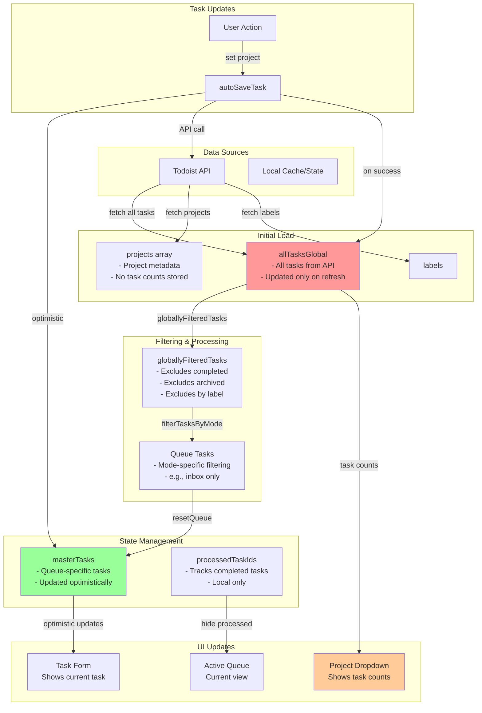
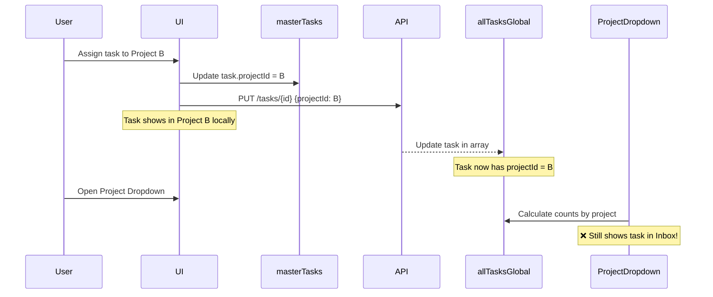
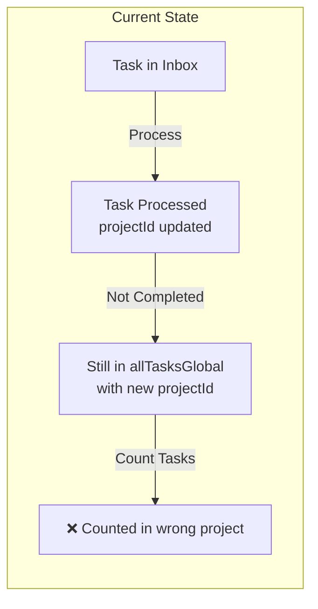
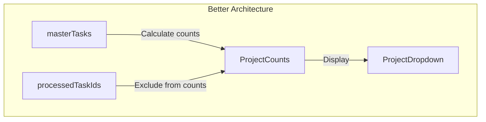

# Data Flow Architecture - Task Count Issue Analysis

## Overview
This document analyzes why task counts in the Projects dropdown are not updating after tasks are processed (moved to other projects).

## Current Architecture



## The Problem

When you process tasks and assign them to projects:

1. **Optimistic Updates** - `masterTasks` is updated immediately with the new project assignment
2. **API Updates** - The server is notified and saves the change
3. **Global State** - `allTasksGlobal` is updated to reflect the change
4. **BUT** - The task counts in the Project dropdown are calculated from `allTasksGlobal` which still shows tasks in their original projects

## Why This Happens



## Root Cause Analysis

The issue is in how task counts are calculated. Let's trace through the code:

1. **Task Filtering** - When calculating task counts for projects, the code likely:
   - Filters `allTasksGlobal` by `projectId`
   - But tasks that were originally in Inbox (`projectId = inbox_id`) are still being counted there

2. **The Missing Link** - After updating a task's project:
   - `masterTasks` has the correct project assignment
   - `allTasksGlobal` is updated with the new project
   - But the **task count calculation** might be:
     - Using stale data
     - Not excluding processed tasks
     - Including tasks that have been moved

## Potential Issues

### Issue 1: Task Count Calculation
```javascript
// Likely current implementation
const inboxTasks = allTasksGlobal.filter(task => 
  task.projectId === inboxProject.id && 
  !task.isCompleted
)
// This would still count tasks that were processed but not completed
```

### Issue 2: Processed vs Completed
- **Processed**: Task has been handled in the queue (local state)
- **Completed**: Task is marked as done in Todoist (server state)
- Tasks can be processed (moved to another project) without being completed

### Issue 3: Data Synchronization


## Solution Options

### Option 1: Use processedTaskIds in Count Calculation
```javascript
const getTaskCountsForProjects = (tasks, projectIds, processedIds) => {
  return projectIds.map(projectId => {
    const projectTasks = tasks.filter(task => 
      task.projectId === projectId && 
      !task.isCompleted &&
      !processedIds.includes(task.id) // Exclude processed tasks
    )
    return projectTasks.length
  })
}
```

### Option 2: Real-time Sync After Updates
```javascript
// After updating a task's project
const handleProjectUpdate = async (taskId, newProjectId) => {
  // 1. Update locally
  await autoSaveTask(taskId, { projectId: newProjectId })
  
  // 2. Force refresh task counts
  await refreshProjectTaskCounts()
}
```

### Option 3: Use Master Tasks for Counts
Instead of using `allTasksGlobal` for counts, use the source of truth that has the latest updates:



## Recommended Fix

The most robust solution would be:

1. **Track Task Movements** - Maintain a map of task movements:
   ```javascript
   const taskMovements = {
     'task123': { from: 'inbox_project_id', to: 'work_project_id' }
   }
   ```

2. **Adjust Count Calculation**:
   ```javascript
   const getProjectTaskCount = (projectId) => {
     const tasks = allTasksGlobal.filter(task => {
       // Include tasks currently in this project
       if (task.projectId === projectId && !task.isCompleted) {
         // But exclude if it was moved elsewhere
         const movement = taskMovements[task.id]
         if (movement && movement.from === projectId) {
           return false
         }
         return true
       }
       
       // Include tasks moved TO this project
       const movement = taskMovements[task.id]
       if (movement && movement.to === projectId) {
         return true
       }
       
       return false
     })
     
     return tasks.length
   }
   ```

3. **Clear Movements on Refresh** - When reloading from API, clear the movements map

## Implementation Path

1. Find where task counts are calculated (likely in `getTaskCountsForProjects` or similar)
2. Integrate `processedTaskIds` into the calculation
3. Consider task movements when counting
4. Ensure counts update when tasks are processed, not just when completed

## The Actual Issue Found

After investigation, the issue is simpler than expected:

```javascript
// Current implementation in getTaskCountsForProjects
counts[projectId] = tasks.filter(task => {
  if (String(task.projectId) !== String(projectId)) return false;
  // ... other filters
}).length;
```

When you process tasks in the Inbox and assign them to other projects:
1. The task's `projectId` is updated from `inbox_id` to `new_project_id`
2. The task is now counted in the NEW project's count
3. But we're not tracking that this task was originally from the Inbox
4. So the Inbox count doesn't decrease - it just shows tasks that are CURRENTLY in the Inbox

## The Real Solution

We need to track the original source of tasks when processing a queue:

```javascript
// When loading tasks for a queue
const loadTasksForMode = (mode) => {
  const tasks = filterTasksByMode(allTasks, mode)
  // Track original project IDs
  const originalProjectIds = tasks.reduce((acc, task) => {
    acc[task.id] = task.projectId
    return acc
  }, {})
}

// When calculating counts
const getTaskCountsForProjects = (tasks, projectIds, processedTaskIds, originalProjectIds) => {
  return projectIds.map(projectId => {
    const count = tasks.filter(task => {
      // Exclude if task was originally from this project and has been processed
      if (originalProjectIds[task.id] === projectId && processedTaskIds.includes(task.id)) {
        return false
      }
      
      // Include if task is currently in this project and hasn't been processed elsewhere
      if (task.projectId === projectId && !task.isCompleted) {
        // But not if it was processed from another project
        const wasProcessedFromElsewhere = processedTaskIds.includes(task.id) && 
                                         originalProjectIds[task.id] !== projectId
        return !wasProcessedFromElsewhere
      }
      
      return false
    }).length
    
    return { projectId, count }
  })
}
```