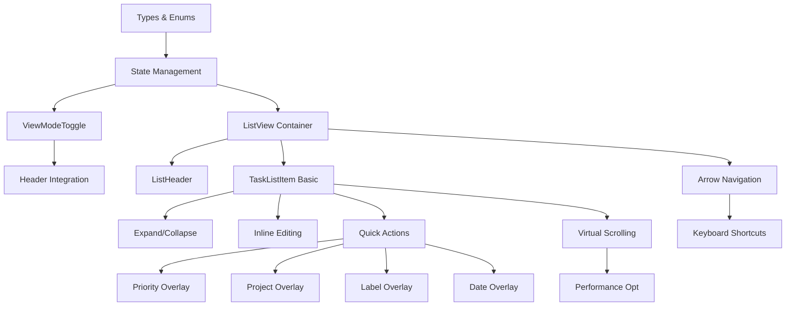

# List View Feature - Implementation Plan

## Executive Summary

This implementation plan outlines the development of the List View feature for the Todoist Inbox Processor. The feature introduces a new viewing mode that displays all tasks in the current queue as a scannable list, complementing the existing single-task processing view.

**Timeline**: 4-5 weeks (single developer or small team)
**Total Story Points**: ~107
**MVP Target**: End of Week 2
**Full Feature**: End of Week 4

## Implementation Priorities & Dependencies

### Critical Path Analysis



### Implementation Order

Based on dependencies and value delivery:

1. **Foundation (Must Have First)**
   - LV-001: Types and Enums (2 pts)
   - LV-002: State Management (3 pts)
   - LV-003: ViewModeToggle (3 pts)
   - LV-005: ListView Container (5 pts)

2. **Basic Functionality**
   - LV-007: Basic TaskListItem (5 pts)
   - LV-004: Header Integration (2 pts)
   - LV-006: ListHeader (3 pts)
   - LV-020: Sort Functionality (3 pts)

3. **Interactions**
   - LV-008: Expand/Collapse (3 pts)
   - LV-010: Quick Actions (3 pts)
   - LV-009: Inline Editing (5 pts)
   - LV-021: Data Model Connection (4 pts)

4. **Overlay Integration**
   - LV-011: Priority Overlay (3 pts)
   - LV-012: Project Overlay (3 pts)
   - LV-013: Label Overlay (4 pts)
   - LV-014: Date Overlay (3 pts)

5. **Keyboard Navigation**
   - LV-015: Arrow Navigation (4 pts)
   - LV-016: Processing Shortcuts (5 pts)
   - LV-017: List-Specific Shortcuts (3 pts)

6. **Performance & Polish**
   - LV-018: Virtual Scrolling (5 pts)
   - LV-019: Re-render Optimization (4 pts)
   - LV-022: Mobile Responsive (4 pts)
   - LV-023: Loading/Error States (3 pts)

7. **Final Polish**
   - LV-024: Accessibility Audit (4 pts)
   - LV-025: Column Preferences (3 pts)
   - LV-026: Unit Tests (5 pts)
   - LV-027: Integration Tests (4 pts)
   - LV-028: Documentation (2 pts)

## Sprint Planning

### Sprint 1 (Weeks 1-2): MVP Implementation
**Goal**: Basic functional List View that users can toggle and use

#### Week 1 Tasks (26 story points)
- **Day 1-2**: Foundation
  - LV-001: Create types and enums (2 pts)
  - LV-002: Update TaskProcessor state (3 pts)
  - LV-003: Build ViewModeToggle component (3 pts)

- **Day 3-4**: Core Components
  - LV-005: Create ListView container (5 pts)
  - LV-007: Build basic TaskListItem (5 pts)
  - LV-004: Integrate toggle into header (2 pts)

- **Day 5**: Context & Display
  - LV-006: Create ListHeader component (3 pts)
  - LV-020: Implement sorting (3 pts)

#### Week 2 Tasks (25 story points)
- **Day 6-7**: Basic Interactions
  - LV-008: Add expand/collapse (3 pts)
  - LV-010: Add quick actions on hover (3 pts)
  - LV-021: Connect to single data model (4 pts)

- **Day 8-9**: Editing Capabilities
  - LV-009: Implement inline editing (5 pts)
  - LV-015: Basic arrow key navigation (4 pts)

- **Day 10**: MVP Polish
  - LV-023: Loading and error states (3 pts)
  - LV-022: Basic mobile responsive (3 pts of 4)
  - Testing and bug fixes

**MVP Deliverable**: 
- Toggle between Processing and List views
- View all tasks in current queue
- Basic sorting and task information display
- Inline editing of task content
- Basic keyboard navigation
- Mobile-friendly layout

### Sprint 2 (Week 3): Full Interactions
**Goal**: Complete overlay integration and keyboard shortcuts

#### Week 3 Tasks (25 story points)
- **Day 11-12**: Overlay Integration
  - LV-011: Priority overlay integration (3 pts)
  - LV-012: Project overlay integration (3 pts)
  - LV-013: Label overlay integration (4 pts)
  - LV-014: Date overlay integration (3 pts)

- **Day 13-14**: Keyboard Excellence
  - LV-016: Port all processing shortcuts (5 pts)
  - LV-017: List-specific shortcuts (3 pts)

- **Day 15**: Performance Foundation
  - LV-018: Virtual scrolling setup (2 pts of 5)
  - LV-019: Initial memoization (2 pts of 4)

### Sprint 3 (Week 4): Performance & Polish
**Goal**: Optimize performance and ensure quality

#### Week 4 Tasks (31 story points)
- **Day 16-17**: Performance
  - LV-018: Complete virtual scrolling (3 pts remaining)
  - LV-019: Complete optimization (2 pts remaining)
  - LV-022: Complete mobile responsive (1 pt remaining)

- **Day 18-19**: Quality & Testing
  - LV-024: Accessibility audit (4 pts)
  - LV-025: Column preferences (3 pts)
  - LV-026: Unit tests (5 pts)

- **Day 20**: Final Integration
  - LV-027: Integration tests (4 pts)
  - LV-028: Documentation (2 pts)
  - Final bug fixes and polish

## MVP Definition

### Minimum Viable Product (End of Week 2)
✅ **Core Features**:
- View mode toggle between Processing and List
- Display all tasks in current queue
- Basic task information (content, project, priority, dates, labels)
- Context-aware column visibility
- Inline editing of task content
- Basic sorting (priority, date, alphabetical)
- Expand/collapse descriptions
- Arrow key navigation
- Mobile responsive layout

❌ **Not in MVP**:
- Overlay integration (use existing edit mode)
- Full keyboard shortcut support
- Virtual scrolling (pagination fallback)
- Column customization
- Grouping functionality
- Bulk operations

### Full Feature (End of Week 4)
✅ **Additional Features**:
- All overlay integrations (priority, project, label, date)
- Complete keyboard shortcut parity with Processing view
- Virtual scrolling for performance
- Optimized re-rendering
- Full accessibility compliance
- Column visibility preferences
- Comprehensive test coverage
- User documentation

## Risk Assessment & Mitigation

### High-Risk Areas

1. **Performance with Large Task Lists**
   - **Risk**: UI becomes sluggish with 500+ tasks
   - **Mitigation**: 
     - Implement pagination in MVP (show 100 tasks max)
     - Add virtual scrolling in Week 3
     - Performance testing with 1000+ task datasets
   - **Fallback**: Hard limit at 500 tasks with "Show More" button

2. **State Synchronization Between Views**
   - **Risk**: Data inconsistencies when switching views
   - **Mitigation**:
     - Use single source of truth (masterTasks)
     - Comprehensive integration tests
     - Code review focus on state management
   - **Fallback**: Force refresh on view switch if issues arise

3. **Mobile Responsiveness Complexity**
   - **Risk**: Poor mobile experience due to information density
   - **Mitigation**:
     - Design mobile layout early (Week 1)
     - Progressive disclosure of information
     - Touch-friendly tap targets
   - **Fallback**: Simplified mobile view with essential columns only

4. **Keyboard Navigation Conflicts**
   - **Risk**: Shortcuts conflict between views or with browser
   - **Mitigation**:
     - Document all shortcuts upfront
     - Test on multiple browsers/OS
     - Consistent modifier key usage
   - **Fallback**: Reduced shortcut set for MVP

### Medium-Risk Areas

1. **Bundle Size Impact**
   - **Mitigation**: Code splitting, tree shaking, lazy loading
   - **Target**: < 30KB additional JavaScript

2. **Inline Editing UX**
   - **Mitigation**: User testing during Week 2
   - **Fallback**: Click to enter edit mode (like current)

3. **Virtual Scrolling Edge Cases**
   - **Mitigation**: Extensive testing with dynamic heights
   - **Fallback**: Fixed row heights

## Testing Strategy

### Unit Testing (Throughout Development)
- **Components**: 80% coverage minimum
  - ViewModeToggle
  - ListView
  - TaskListItem
  - ListHeader
- **Utilities**: 100% coverage
  - Sorting functions
  - Grouping logic
  - Context-aware visibility

### Integration Testing (Week 4)
- View switching maintains state
- Data updates sync between views
- Navigation between queues
- Overlay interactions
- Keyboard shortcut flows

### Performance Testing (Week 3-4)
- Initial render time < 200ms (500 tasks)
- Scroll performance > 60fps
- Memory usage stable over time
- Bundle size impact < 30KB

### User Acceptance Testing (End of Week 2, 4)
- MVP validation with 3-5 users
- Task completion flows
- Mobile usability
- Accessibility validation

### Regression Testing
- Existing Processing View functionality
- Queue navigation
- Task updates and sync
- Keyboard shortcuts

## Success Metrics

### Technical Metrics
- [ ] Initial load time < 200ms (up to 500 tasks)
- [ ] Smooth scrolling at 60fps
- [ ] Bundle size increase < 30KB
- [ ] Zero critical accessibility issues
- [ ] 80%+ test coverage

### User Experience Metrics
- [ ] View toggle discoverable (80% find within 30s)
- [ ] Task scanning 3x faster than Processing View
- [ ] Inline editing success rate > 95%
- [ ] Mobile satisfaction score > 4/5

### Adoption Metrics (Post-Launch)
- [ ] 50% of users try List View within first week
- [ ] 30% of time spent in List View after 1 month
- [ ] < 5% increase in error rates
- [ ] Feature satisfaction > 4/5 stars

## Development Guidelines

### Code Organization
```
src/
├── components/
│   ├── ListView/
│   │   ├── index.tsx
│   │   ├── ListView.tsx
│   │   ├── TaskListItem.tsx
│   │   ├── ListHeader.tsx
│   │   ├── VirtualList.tsx
│   │   └── __tests__/
│   └── ViewModeToggle/
│       ├── index.tsx
│       └── ViewModeToggle.tsx
├── hooks/
│   ├── useListViewState.ts
│   ├── useVirtualScrolling.ts
│   └── useListKeyboardNav.ts
├── utils/
│   ├── list-view-helpers.ts
│   ├── column-visibility.ts
│   └── task-sorting.ts
└── types/
    └── view-mode.ts
```

### Development Principles
1. **Reuse over Rebuild**: Use existing components and logic
2. **Performance First**: Consider performance from the start
3. **Progressive Enhancement**: Basic functionality first, enhance later
4. **Accessibility Always**: Build in accessibility, don't bolt on
5. **Test as You Go**: Write tests alongside implementation

### Code Review Checklist
- [ ] No performance regressions
- [ ] Accessibility standards met
- [ ] Mobile responsive
- [ ] Tests included
- [ ] Documentation updated
- [ ] No console errors/warnings
- [ ] Feature flag compatible

## Communication Plan

### Daily Standups
- Progress against sprint goals
- Blockers and dependencies
- Help needed from team

### Weekly Demos
- End of Week 1: Basic List View demo
- End of Week 2: MVP demonstration
- End of Week 3: Full interaction demo
- End of Week 4: Final feature presentation

### Stakeholder Updates
- MVP ready notification (End Week 2)
- User testing results (Week 3)
- Launch readiness report (End Week 4)

## Rollout Strategy

### Phase 1: Internal Testing (Week 4)
- Team dogfooding
- Bug fixes and polish
- Performance validation

### Phase 2: Beta Users (Post Week 4)
- 10% of users with opt-in
- Feedback collection
- Performance monitoring

### Phase 3: General Availability
- 100% rollout
- Feature announcement
- Documentation publication

## Conclusion

This implementation plan provides a clear path to delivering the List View feature within 4 weeks. The MVP approach ensures users get value quickly while allowing time for polish and optimization. By focusing on the critical path and managing risks proactively, we can deliver a high-quality feature that enhances the task processing experience.

The plan prioritizes:
1. Early user value (MVP by Week 2)
2. Performance from the start
3. Accessibility and mobile experience
4. Comprehensive testing
5. Smooth integration with existing features

Success depends on maintaining focus on the MVP scope, regular testing, and clear communication throughout the development process.